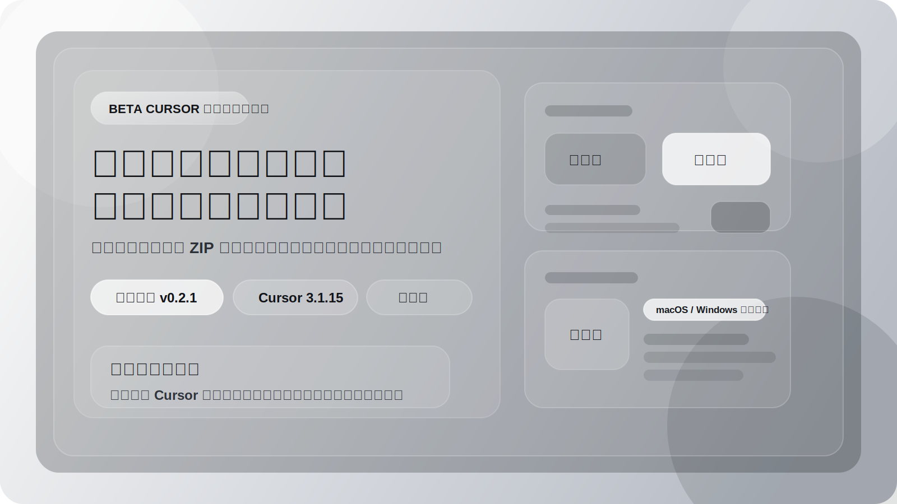
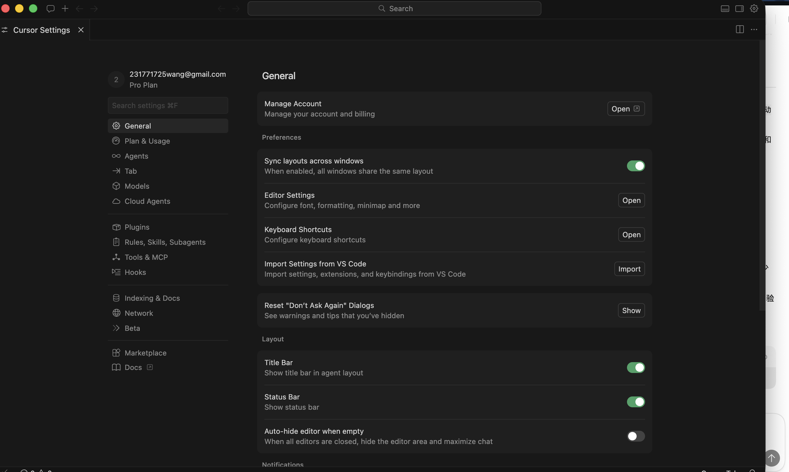
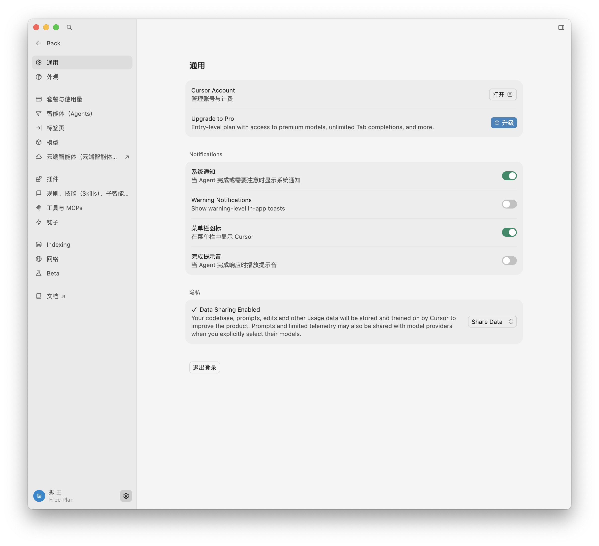
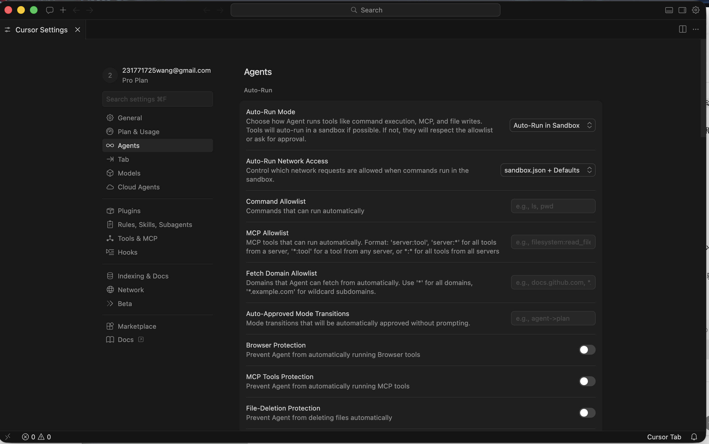
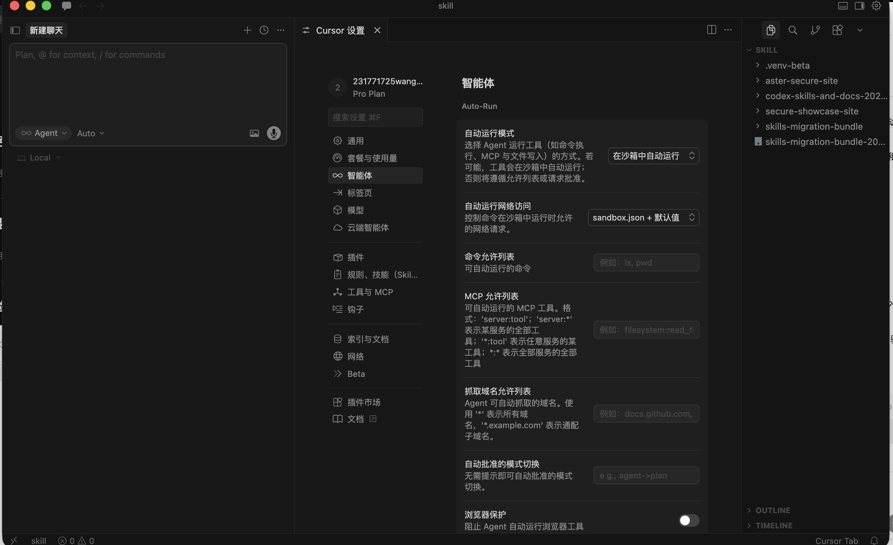
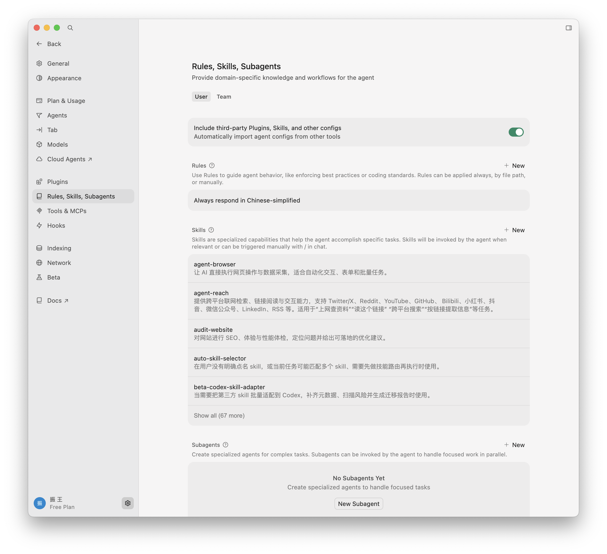
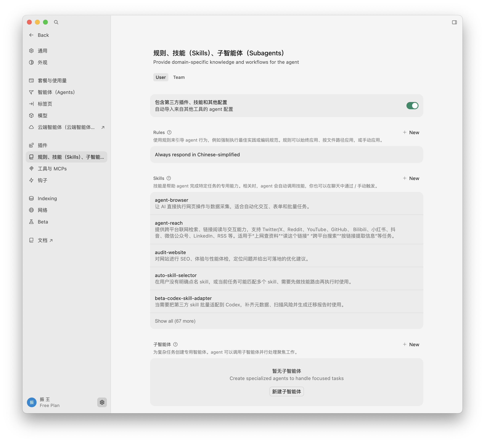

# [English](#english) · [中文](#chinese)

<a id="english"></a>

<div align="center">
  <h1>Beta Cursor Zh Patch</h1>
  <p><em>"Download the real bundle first. Patch your existing Cursor safely. Keep rollback in reach."</em></p>
  <p>
    <a href="./LICENSE"></a>
    <a href="https://github.com/231771725wang-cpu/beta-cursor-zh-patch/releases/tag/v0.2.1"></a>
    
    
    
  </p>
</div>

> **Beta Cursor Zh Patch** is a full local Chinese patch workflow for Cursor Beta: release bundle for end users, source repo for maintainers, rollback path included.

This repository is not a “download the source zip and click around” project. The public-facing install artifact is the GitHub Release bundle, currently validated around Cursor `3.1.15` with release tag [`v0.2.1`](https://github.com/231771725wang-cpu/beta-cursor-zh-patch/releases/tag/v0.2.1).

If you are an end user, start from the release package. If you are maintaining the patch, use the source repo to scan, build, apply, verify, rollback, and export the local bundle again.

## Preview



## Install

### End users

Download the real release bundle instead of the source archive:

- Latest release page: [v0.2.1](https://github.com/231771725wang-cpu/beta-cursor-zh-patch/releases/tag/v0.2.1)
- Direct bundle: [Beta-Cursor-zh-patch-3.1.15-3a67af7b.zip](https://github.com/231771725wang-cpu/beta-cursor-zh-patch/releases/download/v0.2.1/Beta-Cursor-zh-patch-3.1.15-3a67af7b.zip)

After extracting the bundle:

- macOS: run `macOS/安装.command`
- Windows: run `Windows/安装.bat`

### Maintainers

Clone the source repository:

```bash
git clone git@github.com:231771725wang-cpu/beta-cursor-zh-patch.git
cd beta-cursor-zh-patch
```

## What You Get

- A real release bundle for non-technical users
- Local patching instead of replacing or reinstalling Cursor
- Rollback scripts and local state packaged with the bundle
- Source commands for `scan / build / qa / apply / verify / rollback / export-*`
- Screenshot-based evidence of the before/after UI

## How It Works

1. Scan an existing Cursor install and collect patch targets.
2. Build the local Chinese patch set from repo data and manifests.
3. Apply and verify the patch on an already-installed Cursor app.
4. Export a local bundle for GitHub Releases when the patched build is ready.
5. Keep rollback metadata and backups so the install can be reverted safely.

## Sections

[Preview](#preview) · [Install](#install) · [What You Get](#what-you-get) · [How It Works](#how-it-works) · [Before / After](#before--after) · [Developer Workflow](#developer-workflow) · [Boundaries](#boundaries)

## Before / After

| Before | After |
| --- | --- |
|  |  |
|  |  |
|  |  |

## Developer Workflow

Prerequisites:

- Python `3.9+`
- An installed Cursor app that you are allowed to patch locally

Common commands:

```bash
./cursor-zh scan --cursor-app /Applications/Cursor.app/Contents/Resources/app
./cursor-zh build
./cursor-zh qa
./cursor-zh apply --cursor-app /Applications/Cursor.app/Contents/Resources/app
./cursor-zh verify
./cursor-zh rollback
```

Export a release bundle for distribution:

```bash
./cursor-zh export-local-bundle --zip
```

Experimental overlay export:

```bash
./cursor-zh export-store-extension
```

## Boundaries

- This is a local patch workflow, not an official Cursor language pack.
- The release bundle modifies an existing Cursor installation; it does not install another copy of Cursor.
- Local runtime state and rollback data stay under the bundle payload, not in a remote service.
- Cursor upgrades can change hard-coded strings, private extension keys, and scan targets, so new versions may require rescanning and rebuilding.

## Project Layout

- `cursor_zh/`: core CLI and patch logic
- `data/`: translations, glossary, and coverage data
- `payload/patch_manifest.json`: versioned patch manifest bundled with the repo
- `beta-cursor-hanhua/`: experimental overlay layer for private-extension-visible strings
- `tests/`: CLI and bundle tests
- `对比截图/`: before / after screenshots used in the GitHub landing page

## Disclaimer

This project is not affiliated with Cursor. Use it only on installations you are authorized to modify.

---

<a id="chinese"></a>

<div align="center">
  <h1>Beta Cursor 中文完整本地化方案</h1>
  <p><em>“先下真正可安装的补丁包，再给现有 Cursor 打补丁，回滚也要留在手边。”</em></p>
  <p>
    <a href="./LICENSE"></a>
    <a href="https://github.com/231771725wang-cpu/beta-cursor-zh-patch/releases/tag/v0.2.1"></a>
    
    
    
  </p>
</div>

> **Beta Cursor 中文完整本地化方案** 把 Cursor Beta 的中文补丁做成了两层交付：普通用户拿 Release 安装包，维护者用源码仓库继续扫描、构建、验证、导出和回滚。

这个仓库不是给普通用户直接下载 `Source code.zip` 后自己摸索的。真正面向安装的是 GitHub Release 里的补丁包；当前最新公开版本是 [`v0.2.1`](https://github.com/231771725wang-cpu/beta-cursor-zh-patch/releases/tag/v0.2.1)，对应 Cursor `3.1.15` 的本地补丁导出包。

如果你只是想装汉化，正确入口是 Release 包；如果你要维护补丁链路，才进入这个源码仓库继续做 `scan / build / qa / apply / verify / rollback / export-*`。

## 效果


## 安装

### 普通用户

请下载真正的 Release 补丁包，而不是源码压缩包：

- 最新发布页：[v0.2.1](https://github.com/231771725wang-cpu/beta-cursor-zh-patch/releases/tag/v0.2.1)
- 直接下载：[Beta-Cursor-zh-patch-3.1.15-3a67af7b.zip](https://github.com/231771725wang-cpu/beta-cursor-zh-patch/releases/download/v0.2.1/Beta-Cursor-zh-patch-3.1.15-3a67af7b.zip)

解压之后：

- macOS：运行 `macOS/安装.command`
- Windows：运行 `Windows/安装.bat`

### 开发者 / 维护者

如果你要维护源码仓库，使用：

```bash
git clone git@github.com:231771725wang-cpu/beta-cursor-zh-patch.git
cd beta-cursor-zh-patch
```

## 你会得到什么

- 一个面向普通用户的真实 Release 安装包
- 基于现有 Cursor 安装做本地补丁，而不是重装另一个 Cursor
- 自带回滚脚本和本地状态记录
- 一套完整源码命令：`scan / build / qa / apply / verify / rollback / export-*`
- 可直接放在 GitHub 首页里的前后对比截图证据

## 核心工作方式

1. 先扫描现有 Cursor 安装，找出补丁目标。
2. 再根据仓库数据和清单构建中文补丁集。
3. 将补丁应用到已安装的 Cursor，并执行验证。
4. 当版本准备就绪后，再导出本地完整补丁包用于 GitHub Releases 分发。
5. 全程保留回滚元数据和备份，保证补丁可撤回。

## 快速导航

[效果](#效果) · [安装](#安装) · [你会得到什么](#你会得到什么) · [核心工作方式](#核心工作方式) · [前后对比](#前后对比) · [开发者工作流](#开发者工作流) · [边界说明](#边界说明)

## 前后对比

| 汉化前 | 汉化后 |
| --- | --- |
|  |  |
|  |  |
|  |  |

## 开发者工作流

前置条件：

- Python `3.9+`
- 一份你有权在本地修改的 Cursor 安装

常用命令：

```bash
./cursor-zh scan --cursor-app /Applications/Cursor.app/Contents/Resources/app
./cursor-zh build
./cursor-zh qa
./cursor-zh apply --cursor-app /Applications/Cursor.app/Contents/Resources/app
./cursor-zh verify
./cursor-zh rollback
```

导出给别人安装的 Release 包：

```bash
./cursor-zh export-local-bundle --zip
```

实验性 overlay 导出：

```bash
./cursor-zh export-store-extension
```

## 边界说明

- 这是一套本地补丁方案，不是 Cursor 官方语言包。
- Release 补丁包只会修改你机器上已经安装好的 Cursor，不会额外安装另一个 Cursor。
- 运行状态、回滚信息和备份都在本地 payload 内，不依赖远程服务。
- Cursor 升级后，硬编码文案、私有扩展键名和扫描目标都可能变化，所以新版本往往需要重新扫描、重新构建和重新导出。

## 项目结构

- `cursor_zh/`：CLI 与补丁主逻辑
- `data/`：翻译、术语表与覆盖率数据
- `payload/patch_manifest.json`：随仓库附带的版本化补丁清单
- `beta-cursor-hanhua/`：实验性 overlay 层，只覆盖部分私有扩展可见文案
- `tests/`：CLI 与 bundle 测试
- `对比截图/`：GitHub 首页使用的前后对比截图

## 免责声明

本项目与 Cursor 官方无关。请仅在你有权修改的 Cursor 安装上使用。
