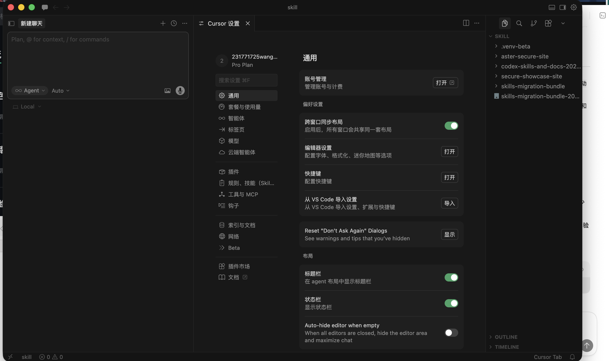
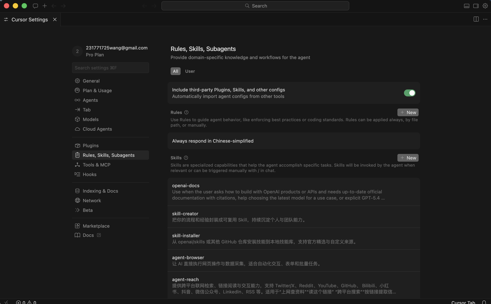
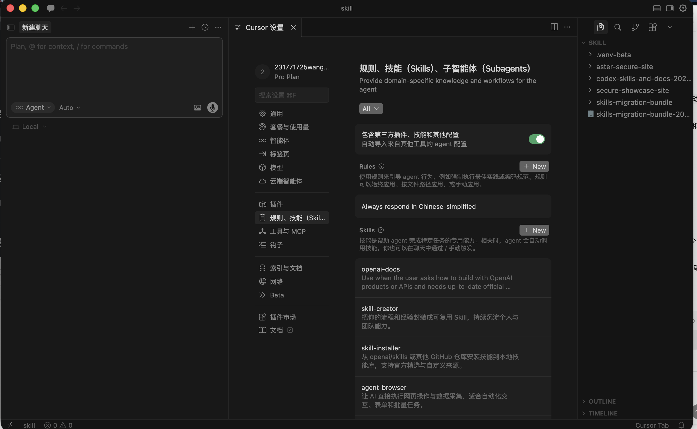

# Beta Cursor 中文完整本地化方案

[](https://github.com/231771725wang-cpu/beta-cursor-zh-patch/releases)
[](https://github.com/231771725wang-cpu/beta-cursor-zh-patch/blob/main/LICENSE)
[](https://github.com/231771725wang-cpu/beta-cursor-zh-patch/actions/workflows/cross-platform-smoke.yml)

这不是一个“给官方语言包打补丁”的附属项目，而是一套面向 Cursor Beta 的独立完整本地化方案。

它要解决的不是“把能翻的地方顺手翻一下”，而是把 Cursor 真正做成一套对中文用户足够完整、足够连贯、足够像原生产品的使用体验。为此，它会直接处理核心设置、Agents、Rules / Skills / Subagents，以及标准语言包碰不到的主程序硬编码文案。

如果你要的是一个可安装、可回滚、可导出、可分发、可长期维护的中文主方案，而不是一层依附官方语言包的零散补丁，这个仓库就是为那件事做的。

本仓库只包含补丁脚本、翻译数据和说明，不包含 Cursor 原始安装包或官方资源备份文件。

## 亮点

- 独立定位：不把官方简体中文语言包当主路径，而是把“完整中文体验”本身当成一等目标。
- 深度覆盖：不只翻公开接口，也补齐 Cursor 私有界面、Agents 工作流和主程序硬编码文案。
- 工程化交付：默认提供 macOS / Windows 安装、回滚与 bundle 导出能力，适合自用，也适合稳定分发。

## 截图对比

### General / 通用

| Before | After |
| --- | --- |
|  |  |

### Agents / 智能体

| Before | After |
| --- | --- |
|  |  |

### Rules, Skills, Subagents / 规则、技能、子智能体

| Before | After |
| --- | --- |
|  |  |

## 当前状态

- macOS（Apple Silicon）已验证可用
- Windows 已补充启动器与 GitHub Actions 脚本级冒烟验证，但暂未做作者本人实机长时间验证
- 仓库默认附带 macOS 与 Windows 两套安装/回滚入口
- `export-local-bundle` 是主分发路径；`export-store-extension` 仅保留为实验性附属产物

## 安装

详细说明见 [使用说明.txt](使用说明.txt)。

### macOS

1. 下载或克隆仓库后，先把目录移到 `~/work`、`~/Applications` 或其他非“桌面/下载/文稿”位置。
2. 进入 `macOS/`，运行 `安装.command`。
3. 如遇到 Gatekeeper 提示，可先执行：

```bash
xattr -dr com.apple.quarantine "<仓库目录>"
```

4. 如需手动指定 Cursor 路径，可运行：

```bash
./macOS/安装.command /Applications/Cursor.app
```

### Windows

1. 进入 `Windows/`，运行 `安装.bat`。
2. 默认会尝试查找：

```text
C:\Users\<You>\AppData\Local\Programs\Cursor\resources\app
```

3. 如需手动指定路径，可运行：

```bat
Windows\安装.bat "C:\Users\<You>\AppData\Local\Programs\Cursor\resources\app"
```

## 产物路线

- 主产物：仓库根目录安装/回滚入口，以及 `python -m cursor_zh export-local-bundle` 导出的本地完整补丁 bundle。
- 实验产物：`python -m cursor_zh export-store-extension` 导出的私有扩展汉化覆盖层，只覆盖 Cursor 私有扩展中已暴露到 `package.nls.json` 的文案。
- 如果你追求和本仓库截图接近的覆盖率，应优先使用主产物；实验产物不等价于完整汉化。
- 如需额外补齐 Cursor / VS Code 公共界面的通用简体中文，可自行叠加官方简体中文语言包，但这不是本项目主产物的前置条件。

## 回滚

- macOS：运行 `macOS/回滚.command`
- Windows：运行 `Windows/回滚.bat`

## 项目结构

- `payload/cursor_zh/`：补丁主逻辑
- `payload/data/`：翻译数据、术语表与覆盖短语
- `macOS/`：macOS 安装与回滚入口
- `Windows/`：Windows 安装与回滚入口
- `assets/screenshots/`：README 对比截图
- `beta-cursor-private-zh-overlay/`：实验性私有扩展汉化覆盖层的默认导出目录

## 注意事项

- 这是本地补丁，不是 Cursor 官方语言包
- 主产物可独立工作；官方简体中文语言包最多只是可选叠加，不是必装依赖
- 首次从浏览器下载到 macOS 时，系统可能会拦截未签名脚本，这是系统安全策略，不代表补丁损坏
- 如果补丁目录位于“桌面/下载/文稿”，macOS 还可能要求给 Terminal 打开“文件与文件夹”权限
- 发布到 GitHub 时，建议使用 Releases 分发 ZIP，避免直接让用户复制零散文件

## 免责声明

本项目与 Cursor 官方无关，仅供个人学习、界面本地化和交流使用。请在你拥有合法 Cursor 使用权的前提下使用本补丁。

## 许可证

待发布时确认。  
如果你想要一个对首个开源项目最省心的方案，推荐使用 `MIT License`。
